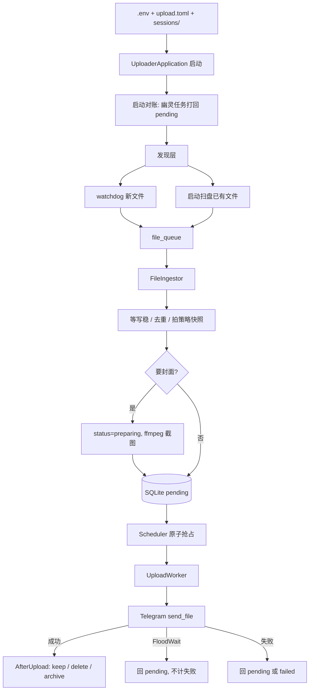
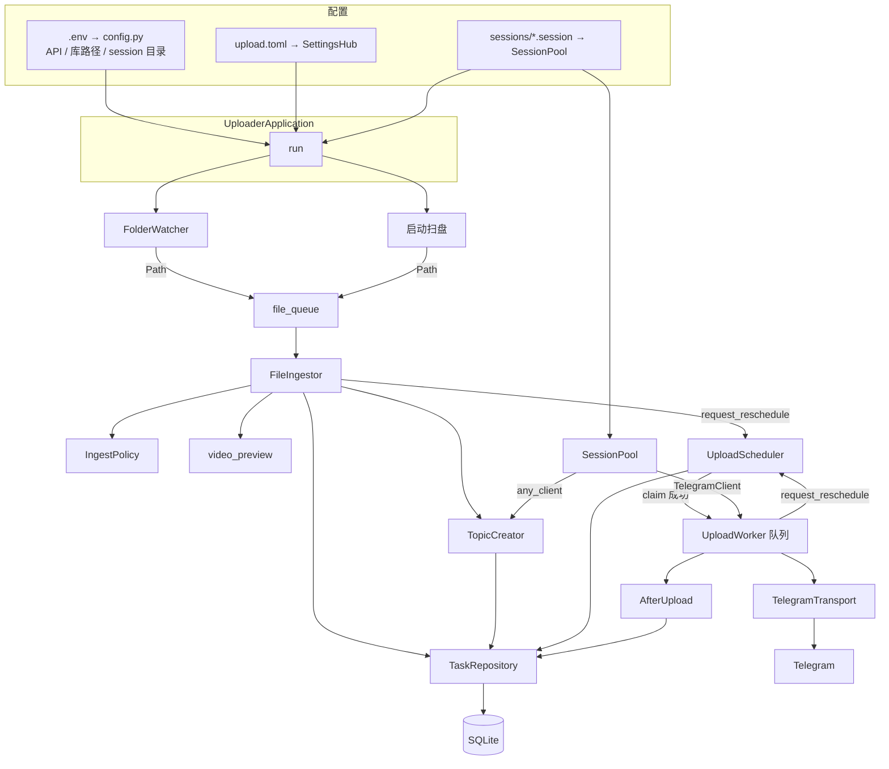

# uploader

监听目录里的视频，入库后用 Telegram session 上传到指定群（可选论坛话题 + 封面图）。

系统身份在 `.env`（改完要重启）。上传策略在 `upload.toml`（保存即热更新）。`sessions/*.session` 运行中放入/拿走会自动加载/卸载。

## 工作流程

状态：`preparing → pending → assigned → uploading → success | failed`。失败未超次数回到 `pending`。

## 零件如何连起来

唯一的装配点是 `UploaderApplication`（`src/pipeline/application.py`）。各阶段 **不互相 import 对方的实现**，只通过下面几根线说话。

### 谁创建谁（启动时）

`main.py` 只调用 `UploaderApplication().run()`。`run()` 里按这个顺序接线：

1. `init_db()` 建表。
2. `SettingsHub` 读 `upload.toml`（没有就从 example 复制）。
3. `TaskRepository` 对账：把上次挂掉的 `assigned` / `uploading` / `preparing` 打回 `pending`。
4. `SessionPool` 盯着 `sessions/`；`UploadScheduler` 拿着仓库 + 配置。
5. `TopicCreator(session_pool.any_client, repository)`：发话题时现取一个在线 client，session 被卸掉也不会握着死连接。
6. `FileIngestor(repository, scheduler, settings_hub, topic_creator)`：入库后用调度器的 `request_reschedule()` 叫醒分发。
7. `FolderWatcher(observer_path, file_queue.put)`：watchdog 只往队列丢路径，不碰数据库。
8. 启动扫盘把已有视频也 `put` 进同一条队列。
9. `_sync_sessions`：每个授权成功的 session 做一个 `UploadWorker`，塞进 `scheduler.worker_map`，并在 TaskGroup 里跑 `serve_forever()`。

之后常驻四类循环：监听、ingest 消费队列、调度、每 2 秒热更新 toml + 再扫 session。

### 运行时三根线

| 线 | 连的是谁 | 传什么 |
|---|---|---|
| `file_queue` | Watcher / 扫盘 → Ingestor | 本地 `Path` |
| SQLite | Ingestor、Scheduler、Worker、TopicCreator | 任务状态（唯一真相） |
| `request_reschedule()` | Ingestor 入库后、Worker 做完一条后 → Scheduler | 无数据，只是叫醒「立刻再抢一轮」 |

Worker 自己还有一条 **内存任务队列**。调度器 CAS 抢到 `pending` 后 `enqueue_task`；Worker 不直接查「有没有新文件」。

Session 热插拔也是 Application 连的：磁盘多了 `.session` → `SessionPool.ensure_client` → `new UploadWorker(transport=TelegramTransport(client))` → `scheduler.register_worker`。文件没了则先 `unregister`，再 `worker.stop`，再断开 client。

### 配置怎么灌进去

- **过程参数**（并发、超时）：Scheduler / Worker 每次做事调 `settings_hub.get()`，改 toml 下一轮就生效。
- **任务参数**（删不删文件、重试次数、要不要封面）：Ingestor 入库时 `policy_for_new_task` 拷进这条任务；Worker 成功收尾读的是 `task.policy`，不是此刻的 toml。
- **发送目的地**：Ingestor 写入 `chat_id` / `topic_id`；`TelegramTransport` 发送时带 `reply_to=topic_id`。

### 接口和实现

`ports/` 只定义形状，`adapters/` 才碰 Telegram / 磁盘：

- Worker 依赖 `Transport` + `AfterUpload`，实际注入的是 `TelegramTransport` 和 `ConfigurableAfterUpload`。
- Ingestor 依赖 `Rescheduler`，实际注入的是 `UploadScheduler`（只调用 `request_reschedule`）。
- 换发送实现或换收尾策略，只换 Application 里那一次构造，不必改 Scheduler。

## 关键约定

- **SQLite 是真相源**。内存队列在进程被杀后会丢，启动时把 `assigned` / `uploading` / `preparing` 打回 `pending`。
- **策略快照**：入库时把「传完是否删文件、重试次数」拷进任务。之后改 `upload.toml` 只影响新文件。
- **FloodWait**：Telegram 限流，不是文件坏了。任务回队列且不增加失败次数，该 session 暂停接新活。
- **论坛话题**：创建话题后发送必须带 `reply_to=topic_id`，否则进群的 General。
- **Session**：`sessions/Homa.session` 的文件名就是 worker 名。放入或拿走文件约 2 秒后自动加载/卸载。

## 目录与文件

| 路径 | 作用 |
|---|---|
| `src/main.py` | 进程入口 |
| `src/config.py` | 系统配置：API、数据库路径、session 目录 |
| `src/logger.py` | 控制台 + 滚动文件日志 |
| `src/pipeline/application.py` | 装配各阶段、生命周期、热加载 session/配置 |
| `src/pipeline/discover/watcher.py` | watchdog 监听目录 |
| `src/pipeline/discover/scan.py` | 启动时扫已有文件 |
| `src/pipeline/ingest/policy.py` | 是否入库、要哪种封面 |
| `src/pipeline/ingest/ingestor.py` | 写稳、建话题、入库、截图 |
| `src/pipeline/schedule/scheduler.py` | 从 DB 抢 pending 分给 worker |
| `src/pipeline/worker.py` | 取任务并上传 |
| `src/domain/task.py` | 任务对象与状态 |
| `src/domain/upload_settings.py` | 可热更新的上传策略结构 |
| `src/domain/settings_hub.py` | 读/热更新 `upload.toml`，给任务拍策略快照 |
| `src/domain/concurrency.py` | 可随配置变化的并发闸门 |
| `src/ports/transport.py` | 发送接口：成功 / 限流 / 失败 |
| `src/ports/after_upload.py` | 上传成功后本地收尾接口 |
| `src/ports/rescheduler.py` | 唤醒调度器的接口 |
| `src/adapters/sessions.py` | 扫描并连接 `sessions/*.session` |
| `src/adapters/telegram_transport.py` | Telethon 实际发送 |
| `src/adapters/after_upload.py` | keep / delete / 归档 |
| `src/adapters/task_store.py` | SQLite 任务表读写 |
| `src/database/connection.py` | 打开 SQLite |
| `src/database/init.py` | 建表 |
| `src/utils/topic_creactor.py` | 按目录创建/复用论坛话题 |
| `src/utils/video_preview.py` | ffmpeg 首帧 / 网格封面 |
| `.env` / `.env.example` | API 等系统配置 |
| `upload.toml` / `upload.toml.example` | 上传策略 |
| `sessions/` | Telegram session 文件 |

启动：`python -m src.main`（在项目根目录）。
